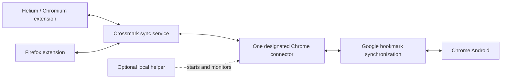

# Crossmark Chrome Android bridge implementation plan

Date: 2026-09-15  
Status: Deferred; explicitly excluded from the first release.  
Depends on: [Desktop extension implementation](../README.md).

## 1. Scope and confirmed decisions

- The first release contains no Chrome Android bridge, hosted Chrome sessions, desktop helper, bridge onboarding/status, or bridge-specific permissions.
- This document preserves the future implementation design; it is not a commitment to a release date or to launch every option together.
- Keep the product native: extensions modify browser bookmarks and Chrome's own account synchronization carries them to/from Android.
- A participating desktop Chrome installation can act as the future connector. A separate local/hosted bridge is intended for users who do not use Chrome as their desktop browser.
- Future options are a dedicated user-owned Chrome profile and a paid hosted Chrome environment. A helper can optionally automate local Chrome availability.
- Reuse the desktop translation and sync engine. Do not reinitialize a user's existing Crossmark collection when a bridge connects.
- The account's first connected installation initializes its bookmark collection, as specified in the desktop plan. That installation is not a permanent primary: subsequent edits remain bidirectional.
- Default status remains the toolbar icon and user-opened popup. Website toasts remain opt-in; no auto-opening sync window.
- Minimize Google account access, but do not claim a hosted Google-authenticated Chrome profile has Google-enforced bookmark-only authority.

## 2. Architecture and integration contracts

The connector runs in existing desktop Chrome, a dedicated user-owned profile, or a hosted environment. Initially allow one active connector per Google bookmark collection. Use a lease and explicit handoff when migrating between local and hosted modes, rather than running both against one collection.

### Future additions to the desktop codebase

- Connector record: collection association, local/hosted type, lease, heartbeat, account generation, and observable health.
- Service endpoints to register, claim, renew, and release a connector lease; scope all credentials to the intended collection.
- Chromium adapter capability to select and validate an account-backed root. Distinguish account-backed/local-only folders and pause on sign-out or account changes rather than propagating mass deletion.
- `apps/helper/` for the optional native host and OS user agent; bridge hosting infrastructure isolated from the main service.
- Separate Crossmark device credentials from Chrome's Google session. Neither the helper nor the general backend should receive copied Google cookies/tokens.
- A bridge joining an existing account must reconcile pre-existing Google bookmarks through a reviewed import plan; it cannot silently replace the account's initialized collection or erase Google's existing collection.

### Delivery boundaries

- Chrome must be running with the correct profile loaded; a visible window is not always necessary.
- Local bridging pauses while Chrome is fully stopped or its computer is asleep/offline/off.
- Hosted bridging can continue without the user's computer, but only for changes already received by Crossmark or Google.
- A local browser API write is not proof of Google upload or Android receipt.
- Crossmark cannot use ordinary public Google OAuth as a bookmark read/write replacement for Chrome Sync.
- No direct profile database edits, copied sessions, or reverse-engineered Google Sync credentials.

## 3. User-owned Chrome bridge

### Onboarding

1. Ask whether Chrome Android synchronization is wanted.
2. If an existing desktop Chrome profile participates, use it; do not create an extra bridge.
3. Otherwise guide installation of official Chrome and creation/selection of a dedicated bridge profile.
4. User signs into Google directly in local Chrome and enables bookmark synchronization; recommend disabling unrelated sync categories.
5. Install Crossmark in that profile and pair it with the collection using Crossmark credentials.
6. Validate the account-backed bookmark root and establish a single connector association.
7. Explain manual versus background availability, Google session ownership, and pause/disconnect behavior.
8. Confirm the round trip with a user-visible test bookmark and cleanup; do not silently modify unrelated bookmarks for diagnostics.

### Runtime flows

| State when a Helium bookmark changes | Result |
| --- | --- |
| Correct Chrome profile running | Helium uploads; Chrome extension applies; Google controls onward delivery. |
| Chrome fully quit, no helper | Upload succeeds; bridge queues until the configured profile starts. |
| Chrome windows closed but profile remains active | Same as running, subject to validated OS/browser background behavior. |
| Chrome running only under another profile | Treat bridge as unavailable until its own heartbeat arrives. |
| Computer asleep/off | Bridge waits; server retains already-uploaded changes. |

On reconnect, pull Android-originated changes as well as applying outbound changes. A heartbeat is not evidence that Google sync is authenticated or healthy; expose separate status where observable, and otherwise report Google delivery as unverified.

Windows/Linux background mode and macOS lifecycle require separate tests. Use browser-supported configuration and user-controlled startup settings; do not silently install machine-wide policies on users' computers. See [Chrome background permission](https://developer.chrome.com/docs/extensions/reference/permissions-list), [background-mode platform support](https://chromeenterprise.google/policies/background-mode-enabled/), and [Google bookmark synchronization](https://support.google.com/chrome/answer/165139?hl=en).

## 4. Optional desktop helper

The helper improves availability without changing ownership of the Google session.

- Install explicitly, with a signed platform-appropriate package and a clear uninstall path.
- Run as the user, not as an administrator/root service.
- Launch the correct Chrome executable/profile at login or when the user enables automatic bridging.
- Prefer keeping the bridge available while the machine is awake over launching and immediately quitting after each bookmark. Local write completion does not prove Google upload.
- Monitor connector heartbeat and Chrome process health, with bounded restart attempts and an explicit paused state.
- Do not relaunch repeatedly after an intentional pause/exit. Specify an explicit user-controllable auto-restart policy.
- Use native messaging with allowlisted extension identities and a narrow command schema. Never expose arbitrary shell execution, filesystem reads, or unrestricted command-line arguments.
- Native messaging alone is not an independent always-running helper. A native host normally starts in response to an extension; starting a stopped Chrome when no extension is running requires a separately configured OS user agent/startup component.
- If on-demand wakeups are offered, authenticate the helper to a status-only endpoint or authenticated local extension channel; it does not need bookmark contents or Google tokens.
- Do not read/copy Chrome's cookies, password storage, or Google credentials.
- Report that Chrome may briefly show a window; invisible startup is a testable platform capability, not a guarantee.
- Handle upgrades, helper/extension version skew, browser path changes, profile locks, and user removal.

Reference: [Chrome native messaging](https://developer.chrome.com/docs/extensions/develop/concepts/native-messaging).

## 5. Paid hosted Chrome bridge

### Security boundary and release condition

A signed-in hosted Chrome instance retains a broader Google session even when configured to synchronize only bookmarks. Our extension's narrow permissions do not constrain the host operator's access. If the requirement becomes Google-enforced bookmark-only authority for the whole service, this implementation does not meet it; use user-owned Chrome unless Google supplies an approved scoped integration.

Official references: [Chrome sign-in and Google services](https://support.google.com/chrome/answer/185277?co=GENIE.Platform%3DDesktop&hl=en), [restricted Chromium sign-in/API access](https://www.chromium.org/developers/how-tos/api-keys/).

### Hosted implementation requirements

- Isolated virtual machine or equivalent reviewed isolation per user/account; never rely on Chrome profiles as tenant security boundaries.
- Official Chrome with its sandbox intact, dedicated persistent profile, and only the approved bridge extension.
- Apply and verify policies before sign-in to disable supported non-bookmark sync categories. Test upgrades for new categories and policy changes.
- Interactive user-driven Google sign-in with account challenges/MFA supported. Do not build our own Google password form or copy existing sessions.
- Disable login-session recording, keystroke capture, sensitive screenshots, and routine authenticated-profile inspection.
- After onboarding, terminate interactive access; restrict runtime network access to validated dependencies and close unnecessary debugging/control interfaces.
- Encrypt per-user storage, restrict workload access, audit exceptional operator access, and design backups/deletion so authenticated profiles do not linger after cancellation.
- Isolate bridge credentials from the general service; enforce per-user authorization and single-connector leasing.
- Monitor browser/profile health, expiration/re-authentication needs, queue age, policy status, and delivery stages without logging bookmark payloads.
- On cancellation/disconnect, stop execution, revoke Crossmark credentials, destroy profile data/keys subject to explicit retention, and guide Google device/session revocation. Never convert disconnect into bookmark deletion.
- Describe residual session trust in onboarding and privacy disclosures. Do not claim that MFA, a sync passphrase, encryption at rest, or an isolated VM creates a bookmark-only Google credential.

### Feasibility work before a launch commitment

- Establish real Google sign-in and bidirectional bookmark sync using dedicated test accounts on the intended infrastructure.
- Confirm policy effectiveness before any user login and test that unrelated account data is not synchronized into the profile.
- Test session longevity, interactive reauthentication, profile persistence, updates, crashes, sleep/restart, and account restrictions.
- Inspect browser launch flags: automation defaults may disable sync or alter sign-in. Do not assume a headless browser or automation distribution behaves like installed Chrome.
- Review provider requirements applicable to operating hosted authenticated browsers; do not represent technical feasibility as provider approval.
- Measure per-user resource cost and service capacity before selecting pricing. Define billing entitlement and suspension without data loss.

Policy references: [disabled sync types](https://chromeenterprise.google/intl/en_au/policies/sync-types-list-disabled/), [extension management](https://support.google.com/chrome/a/answer/9867568?hl=en).

## 6. Status UI and additional permissions

| State | User-facing detail |
| --- | --- |
| Source upload pending | Changes saved locally; waiting for Crossmark |
| Cloud caught up, bridge disconnected | Saved to Crossmark; waiting for Chrome |
| Applied by connector | Applied to Chrome bridge; Google delivery unverified |
| Profile/account unavailable | Open the bridge profile or sign in again |
| Paused | Chrome Android bridge paused |

Keep cloud/device synchronization and bridge availability distinct. A heartbeat does not prove a healthy Google session. Never display “Delivered to Android” without an actual receipt mechanism.

| Feature | Additional permission/setup | Activation |
| --- | --- | --- |
| Local Chrome background retention | Chrome-specific optional `background`, subject to OS validation | Explicit local bridge opt-in |
| Installed helper channel | Optional `nativeMessaging` and allowlisted native-host manifest | Explicit helper installation and pairing |
| Ordinary bridge status icon/popup | Existing `action` UI | No additional permission |

No bridge/helper declarations are required in the first-release manifests. Do not add broad `cookies`, `history`, `tabs`, or `debugger` permissions for the bridge extension. Privileged hosted infrastructure remains a separate trust boundary from extension permissions.

## 7. Security, encryption, and disconnect

Reuse the desktop plan's selected authentication/encryption model. If bookmark payloads are end-to-end encrypted, the hosted bridge is an authorized decrypting endpoint: its runtime can read bookmarks. Do not claim that our hosted infrastructure cannot read them. Encryption at rest does not prevent the operator of an active hosted environment from accessing its authenticated session.

Separate disconnect, pause, subscription expiration, and bookmark deletion. Disconnecting a connector leaves native bookmarks intact. Revoke connector credentials/leases, remove hosted session material under the stated retention policy, and provide Google device/session revocation guidance. A stale connector must be prevented from resuming after migration or cancellation.

## 8. Validation and release gates

- Test both directions through actual Chrome Android with dedicated Google test accounts. Fake adapters and local API success do not establish Google delivery.
- Cover correct/wrong profile, account switch, sign-out, local-only roots, sync disabled/paused, custom passphrases, and reauthentication.
- Test Windows, macOS, and Linux before claiming local/helper support on each platform.
- Cover open, minimized, last window closed, explicit quit, startup, sleep, network recovery, and profile locks.
- Validate Android-originated rename/move/delete as well as creation, ordering, duplicates, and recovery after disconnection.
- Test duplicate connector prevention, lease expiration, local-to-hosted migration, and lost heartbeat without false mass deletion.
- Verify hosted policies before sign-in, absence of non-bookmark synchronized data, isolation, operator access controls, profile retention, and account/session revocation.
- Verify helper install/update/uninstall, version skew, narrow command authorization, pause, bounded crash recovery, and no repeated relaunch against user intent.
- Exercise restoring accidental bookmark deletions without restoring revoked authenticated hosted profiles.
- Measure Google delivery timing and resource costs; do not promise instant Android updates or invent latency SLAs.

## 9. Future delivery milestones

| Milestone | Deliverable | Exit condition |
| --- | --- | --- |
| B0. Scope and feasibility | Decide local/hosted/helper order; real Google integration spike | Technical and security assumptions validated; no first-release dependency |
| B1. Local connector | Profile pairing, account roots, availability/status | Real Android round trip and reconnect pass |
| B2. Optional helper | Native host, OS agent, signed installers | Correct profile starts; pause/uninstall and security tests pass |
| B3. Hosted beta | Isolation, Google login/re-auth, policies, billing, deletion | Security boundary disclosed and technical/security/operations gates pass |
| B4. Release | Support docs, staged updates, incident recovery | Advertised configurations validated and rollback exercised |

B2 and B3 can be independently scheduled after the required feasibility work. Their inclusion in this document does not commit them to the same release.

## 10. Operations and implementation documents

- Track heartbeat, queue age, authentication failures, policy state, and connector version without logging bookmark payloads or Google session material.
- Stage bridge browser/extension updates; test new sync types and policy behavior before upgrading authenticated hosted profiles.
- Maintain dedicated test accounts and separate development/test/production identities.
- Document Crossmark availability separately from Google/Android delivery timing.
- Define billing entitlement, suspension, session destruction, reactivation, backups, and cancellation before a paid beta.

| Proposed document | Contents | Needed before |
| --- | --- | --- |
| `docs/local-chrome-bridge.md` | Profile setup, account roots, topology, OS lifecycle, Google limitations | Local release |
| `docs/desktop-helper.md` | Native host, user agent, narrow protocol, startup/pause, signed install/update | Helper work |
| `docs/hosted-bridge-security.md` | Session threat model, isolation, policies, encryption boundary, operator controls | Hosted user onboarding |
| `docs/hosted-bridge-operations.md` | Provisioning, login/re-auth, upgrades, pricing inputs, suspension/deletion | Hosted beta |
| `docs/bridge-test-plan.md` | Real-browser/Android evidence, migration, revocation, platform matrix | Bridge beta |

These are proposed deliverables, not existing files. Reuse the desktop model/protocol/UI documents and record bridge-specific extensions without turning them into first-release dependencies.
